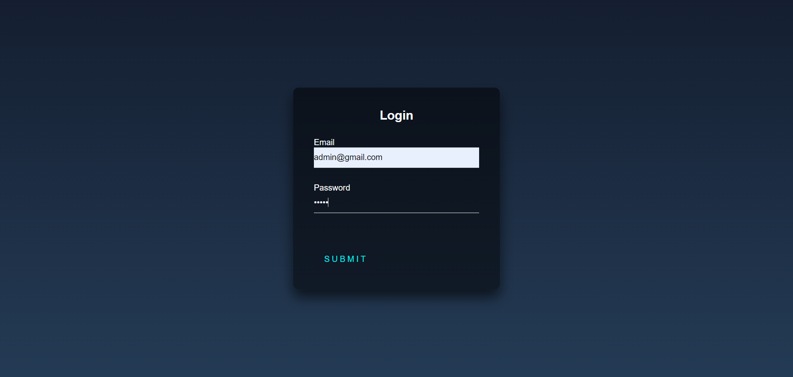
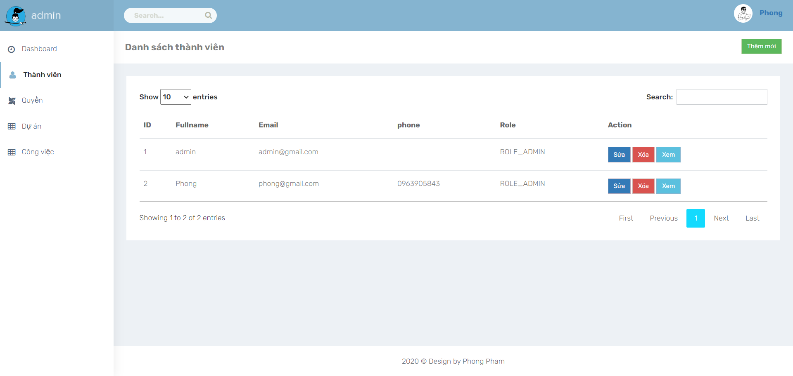
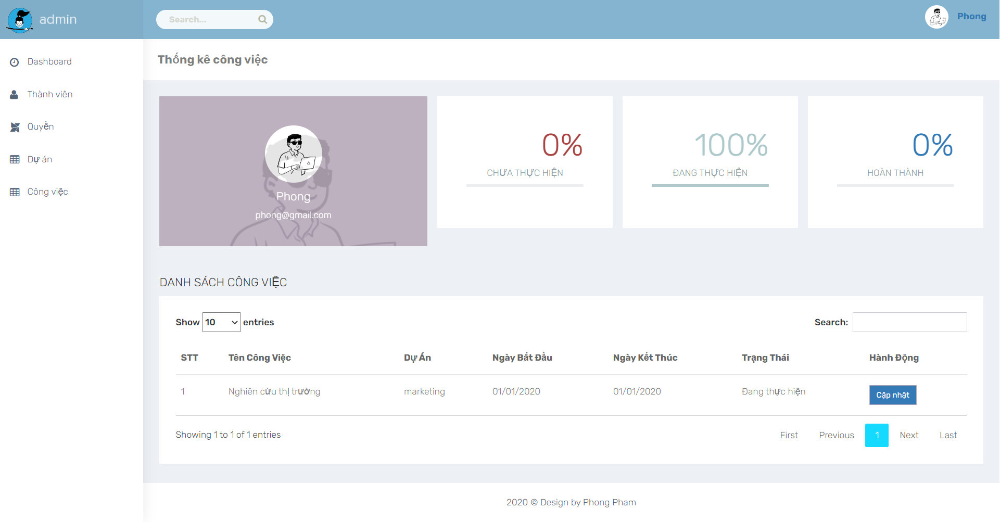
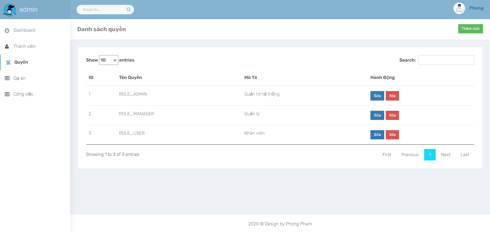

# CRM App Java Servlet
## Table of Contents
* [General Info](#general-information)
* [Technologies Used](#technologies-used)
* [Features](#features)
* [Setup](#setup)
* [Screenshots](#screenshots)
* [Contact](#contact)

## General Information
- Build a simple CRM web app using Java Servlet
- MVC architecture

## Technologies Used
- Eclipse 2022
- JavaSE-11
- Server tomcat v9.0 
- MySQL
- JSP
- JSTL
- JDBC

## Features
- Role management
- User management
- Project management
- Job management

## Setup
- MySQL : run file `crm_app.sql` to create database
- Run server on `http://localhost:8080/CrmApp/` and and first login use email (`admin@gmail.com`) and password (`admin`) to login with ROLE_ADMIN

## Screenshots

## Contact
Created by [@phongpham](https://www.linkedin.com/in/phongphamdev/) - feel free to contact me!
